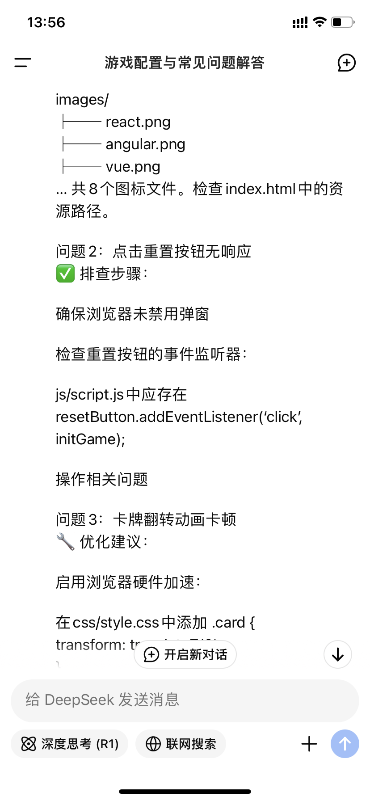
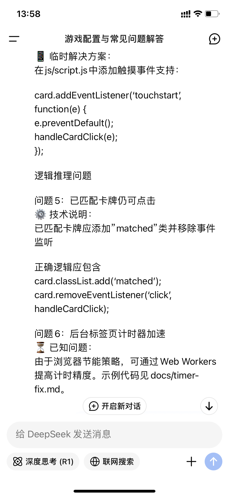

## Screenshot 1:  translate
  
*Translated English into Chinese using AI*

## Screenshot 2:  How can replacement function cases be resolved if they become ineffective
  
*Added event binding verification and compatibility testing issues on the basis of question 2*

## Screenshot 3: How to operate defensive and balance measures  
  
*Added defensive programming solutions and performance balancing suggestions on the original basis*

<!--by zhouxian-->

以下是五个技术术语的中英文对照及解释：  

1. **`querySelectorAll`**  
   - **中文**：DOM 元素选择方法  
   - **英文**：A DOM method that selects all elements matching a specified CSS selector and returns a NodeList.  
   - **解释**：用于通过 CSS 选择器获取文档中所有匹配的元素，返回一个静态的 `NodeList` 集合。  

2. **`classList`**  
   - **中文**：HTML 元素的类名操作接口  
   - **英文**：An interface for manipulating the class attributes of an HTML element.  
   - **解释**：提供 `add()`、`remove()`、`toggle()` 等方法，用于动态修改元素的 CSS 类名。  

3. **`addEventListener`**  
   - **中文**：事件监听方法  
   - **英文**：A method to attach an event handler to an element.  
   - **解释**：为指定的 DOM 元素绑定事件（如 `click`、`keydown`），触发时执行回调函数。  

4. **`setTimeout`**  
   - **中文**：定时器函数  
   - **英文**：A function that executes a callback after a specified delay (in milliseconds).  
   - **解释**：用于延迟执行代码，属于 JavaScript 的异步编程工具。  

5. **`dataset`**  
   - **中文**：HTML5 自定义数据属性访问方式  
   - **英文**：An interface to access custom data attributes (`data-*`) of an element.  
   - **解释**：通过 `element.dataset.key` 读写元素上以 `data-` 开头的自定义属性。  
   
   这些术语是 **Web 前端开发** 中的核心概念，涵盖 DOM 操作、事件处理和异步行为控制。